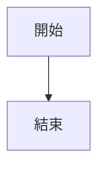

# 精美簡報生成器

## 用法

```bash
bash /Users/halu_1/openClaw/agent-skills/report-generator/scripts/generate-presentation.sh "輸入檔.md" "輸出檔.pdf"
```

## Markdown 簡報格式

用 `---` 分隔每一頁投影片：

```markdown
# 簡報標題

副標題或說明

---

# 第二頁標題

## 小標題

- 要點一
- 要點二
- 要點三

---

# 第三頁：含表格

| 項目 | 數量 | 金額 |
|------|------|------|
| A    | 10   | $100 |
| B    | 20   | $200 |

---

# 第四頁：含圖表



---

# 聯絡我們

感謝觀看
```

## HTML 簡報格式（進階）

直接使用模板 CSS class：

```html
<div class="slide slide-cover">
  <div class="slide-title">標題</div>
  <div class="slide-subtitle">副標題</div>
</div>

<div class="slide slide-content">
  <h1>內容頁</h1>
  <div class="grid-2">
    <div class="card">左欄內容</div>
    <div class="card">右欄內容</div>
  </div>
</div>
```

## 可用 CSS Class

### 投影片類型
- `slide-cover` — 封面（深藍漸層）
- `slide-content` — 一般內容頁
- `slide-section` — 分節頁（藍色漸層）
- `slide-dark` — 深色頁面
- `slide-accent` — 淺藍強調頁

### 排版
- `grid-2` / `grid-3` / `grid-4` — 等寬多欄
- `grid-2-1` / `grid-1-2` — 不等寬二欄
- `card` / `card-accent` / `card-dark` / `card-highlight` — 卡片
- `stat-row` + `stat-box` — 統計數字展示

### 元素
- `label-primary/success/warning/info/outline` — 標籤
- `photo-card` + `caption` — 照片卡片
- `timeline-item` + `timeline-year` + `timeline-desc` — 時間軸
- `check-list` — 打勾清單
- `callout-success` / `callout-warning` — 提示框
- `progress-bar` + `progress-fill` — 進度條
- `accent-line` — 裝飾線

## 注意事項

- 輸出為 A4 橫式 PDF
- Mermaid 圖表自動渲染為 PNG
- 圖片支援 base64 內嵌或本地路徑
- 模板位置：`/Users/halu_1/openClaw/agent-skills/report-generator/templates/presentation.html`
