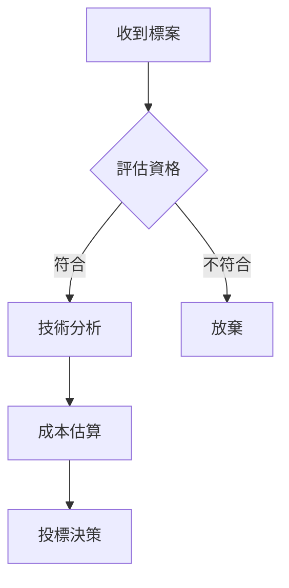
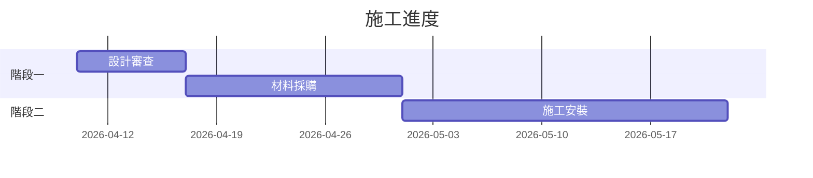
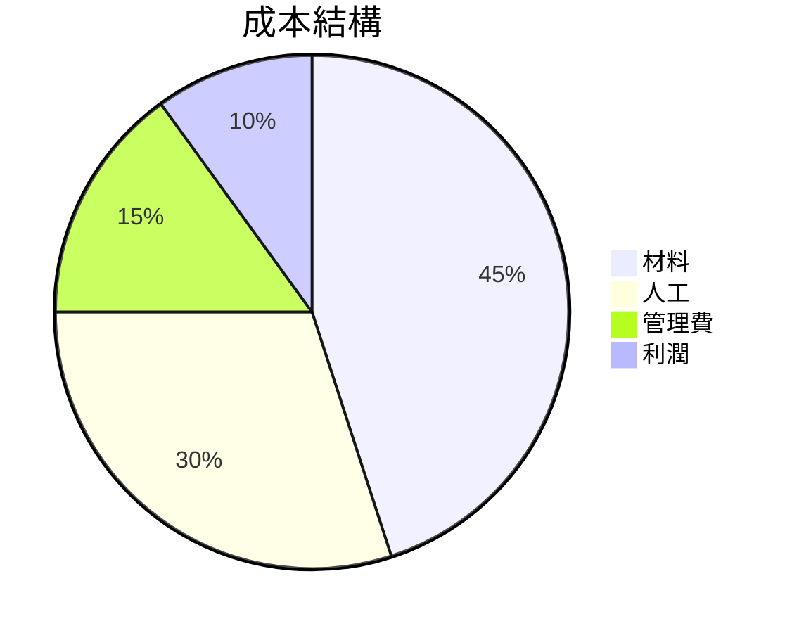
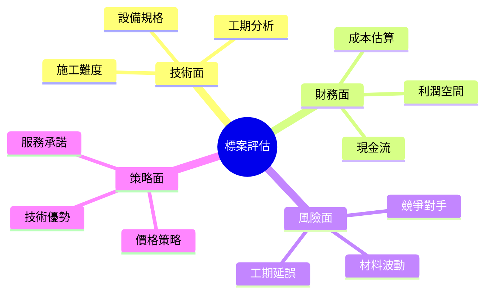
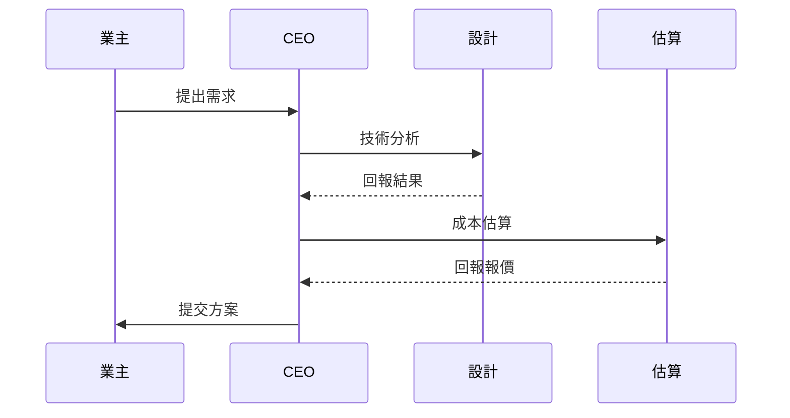
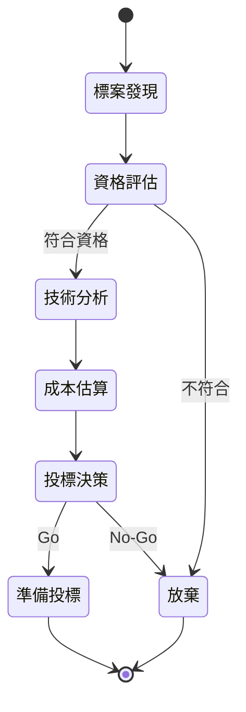

# 報告生成 Skill

將 Markdown 報告轉換為專業排版的 PDF 文件。

## 使用時機

- 產出正式分析報告（標案分析、競爭分析、財務報告等）
- 需要表格、圖表、專業排版的文件
- 給人類審閱的正式產出

## 報告撰寫規範

### 結構要求

每份報告必須包含：

```markdown
# 報告標題

## 摘要
<!-- 2-3 句話概括結論 -->

## 一、[章節名稱]
### 1.1 [小節]
<!-- 正文內容 -->

## 二、[章節名稱]
<!-- 更多章節 -->

## 結論與建議
<!-- 可執行的建議 -->

## 資料來源
1. [來源名稱]（日期）— 網址或文件路徑
2. [來源名稱]（日期）— 網址或文件路徑
```

### 表格規範

所有數據必須用表格呈現，不要用純文字列舉：

```markdown
| 項目 | 數量 | 單價 (TWD) | 小計 (TWD) | 來源 |
|------|------|-----------|-----------|------|
| 消防灑水頭 | 120 個 | 350 | 42,000 | 市場報價 2026/03 |
| 配管 65mm | 200 m | 850 | 170,000 | 供應商 A 報價 |
```

### 圖表規範

需要視覺化的數據用 Mermaid 語法：

**流程圖：**
````markdown

````

**甘特圖：**
````markdown

````

**圓餅圖：**
````markdown

````

**思維導圖（概念分類、架構總覽）：**
````markdown

````

**時序圖（多方互動流程）：**
````markdown

````

**狀態圖（流程狀態變化）：**
````markdown

````

### KPI 卡片

重要數字用 HTML KPI 卡片呈現：

```html
<div class="kpi-row">
  <div class="kpi-card">
    <div class="value">NT$ 1,511,238</div>
    <div class="label">預算金額</div>
  </div>
  <div class="kpi-card">
    <div class="value">45 天</div>
    <div class="label">工期</div>
  </div>
  <div class="kpi-card">
    <div class="value">85%</div>
    <div class="label">預估得標率</div>
  </div>
</div>
```

### 提醒框

重要提醒用 callout：

```html
<div class="callout callout-warning">
  ⚠️ 截止投標日期為 2026-04-13，僅剩 5 天
</div>

<div class="callout callout-info">
  ℹ️ 本分析基於政府電子採購網公開資料
</div>
```

### 標籤

狀態標籤用 badge：

```html
<span class="badge badge-red">緊急</span>
<span class="badge badge-yellow">進行中</span>
<span class="badge badge-green">已完成</span>
<span class="badge badge-blue">參考</span>
```

### 引用規範

**所有數據必須標註來源：**
- 法規 → 標註條文編號（例：建築技術規則第 87 條）
- 市場價格 → 標註來源和日期（例：政府採購網 2026/03 得標資料）
- 供應商報價 → 標註供應商和報價日期
- 知識庫 → 標註文件路徑
- 網路資料 → 標註 URL 和存取日期

在報告最後的「資料來源」章節集中列出所有引用。

## 轉換為 PDF

寫完報告後，用以下指令轉換：

```bash
bash /Users/halu_1/openClaw/agent-skills/report-generator/scripts/generate-pdf.sh \
  "/Users/halu_1/Desktop/Obsidian知識庫/00-Inbox/{你的Agent名稱}/報告檔名.md" \
  "/Users/halu_1/Desktop/Obsidian知識庫/00-Inbox/{你的Agent名稱}/報告檔名.pdf"
```

PDF 會自動套用專業模板（海軍藍配色、頁碼、表格美化）。

## 注意事項

- 報告語言：繁體中文
- 先產出 .md 檔，再轉 .pdf
- .md 和 .pdf 都存到你的 Inbox
- 封面資訊在 markdown 的第一個 H1 標題自動提取
